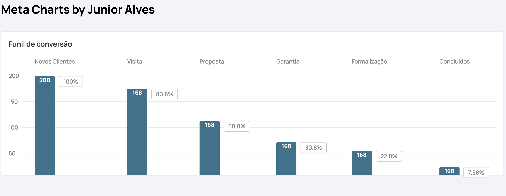

<h1 align="center">Meta-Charts By Junior Alves</h1>
<br>
<h3 align="center"> 🚧  The library is under development 🚧 </h3>

## About the project 💻 
<hr>
A library for graphics

## Screenshots of platform 🖼
<hr>


## Link NPM 🛠
<hr>
<p align="left">
<a href="#" target="_blank">

</a>


## Getting Started 👷
<hr>
To start development, you need to clone the GitHub project into a directory of your choice:

```shell
npm install meta-charts
```

 ## Author 🎓
 <hr>

<table align="center">
    <tr>
        <td align="center">
            <a href="https://github.com/Thejuniordev">
                
                <br />
                <sub><b>Junior Alves</b></sub>
            </a>
        </td>    
    </tr>
</table>
<br /> 

<h4 align="center">
   Made with 💜  by  <a href="https://www.linkedin.com/in/junior-alves-3a8b3296/" target="_blank"> Junior Alves 👋🏽 Entre em contato!</a>
</h4>

 <a href="https://twitter.com/junyor_alves" target="_blank">
    
  </a>

<hr>

 

